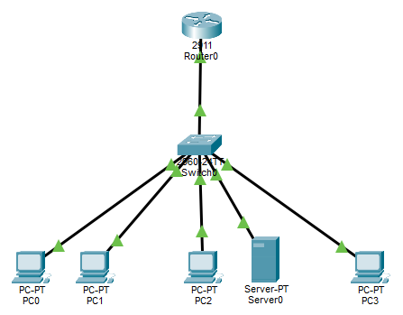

# VLAN Segmentation & DHCP Implementation

This project demonstrates network segmentation using VLANs, DHCP Server, and ACL-based firewall rules to enforce Zero Trust security policies. The design restricts HR access to IT resources while allowing IT support access to HR, minimizing the impact of insider threats.

---

## 📋 Project Objectives

- Demonstrate understanding of **IP addressing**, **subnetting**, and **VLANs**
- Implement **DHCP Server** for automated IP allocation
- Apply **Firewall Rules (ACLs)** for network security
- Document network configuration professionally

---

## 🔐 Security Analysis

> 📖 **Detailed ACL Analysis:** For in-depth explanation of firewall rules, threat scenarios, Zero Trust principles, and security references (NIST/CIS), see [acl_rules_explanation.md](docs/acl_rules_explanation.md)

### Why VLAN Segmentation Matters

VLAN segmentation implements **"Least Privilege"** and **Zero Trust** principles:

1. **Limit Lateral Movement**: Prevent malware/ransomware from HR workstations spreading to IT servers.
2. **Reduce Attack Surface**: IT network is not exposed to all users.
3. **Enable Monitoring**: Inter-VLAN traffic can be monitored and audited.

### Threat Scenario

**Threat:** An HR employee unknowingly downloads malware via phishing email. The malware attempts **lateral movement** to IT servers containing sensitive company data.

**Mitigation:** ACLs on the router block all traffic from VLAN 20 (HR) to VLAN 10 (IT), isolating the attack to the HR workstation.

### Security Principles Applied

| Principle | Implementation |
|:---|:---|
| **Zero Trust** | No default access between VLANs |
| **Least Privilege** | HR only accesses required resources |
| **Network Segmentation** | VLANs separate departments logically |
| **Access Control** | ACLs regulate access permissions |

---

## 🏗️ Network Topology



### Device Details

| Device | VLAN | Subnet | IP | Method | Gateway | Security |
|:---|:---:|:---|:---|:---:|:---:|:---|
| PC0 (IT) | VLAN 10 | 192.168.10.0/24 | DHCP (`192.168.10.100`) | DHCP | 192.168.10.1 | Can access HR |
| PC1 (IT) | VLAN 10 | 192.168.10.0/24 | DHCP (`192.168.10.101`) | DHCP | 192.168.10.1 | Can access HR |
| PC2 (HR) | VLAN 20 | 192.168.20.0/24 | DHCP (`192.168.20.100`) | DHCP | 192.168.20.1 | **Cannot** access IT |
| Server0 (HR) | VLAN 20 | 192.168.20.0/24 | **`192.168.20.50`** | **STATIC** | 192.168.20.1 | **Cannot** access IT |
| PC3 (VALIDATION) | VLAN 30 | 192.168.30.0/24 | DHCP (`192.168.30.100`) | DHCP | 192.168.30.1 | Can access IT (No ACL!) |

### Firewall Rules (ACLs)

| No | Rule | Security Purpose |
|:--:|:---|:---|
| 1 | HR → IT = **BLOCK** | Prevent lateral movement |
| 2 | IT → HR = **ALLOW** | Enable IT support access |
| 3 | VLAN 30 (VALIDATION) | **NO ACL** (control group) |

---

## ✅ Test Results

### DHCP Success


✅ PC0 successfully obtained IP from DHCP Server.

### Server with STATIC IP


✅ Server0 configured with static IP `192.168.20.50`.

### ACL & Routing Test

| Test | From | To | Result | Status | Description |
|:---|:---|:---|:---|:---:|:---|
| 1 | PC0 (IT) | Gateway HR (`192.168.20.1`) | Reply from 192.168.20.1 | ✅ **SUCCESS** | IT can access HR gateway |
| 2 | PC0 (IT) | Server HR (`192.168.20.50`) | Reply from 192.168.20.50 | ✅ **SUCCESS** | IT can access Server HR |
| 3 | PC0 (IT) | PC HR (`192.168.20.100`) | Reply from 192.168.20.100 | ✅ **SUCCESS** | IT can access HR |
| 4 | PC0 (IT) | Gateway VLAN 30 (`192.168.30.1`) | Reply from 192.168.30.1 | ✅ **SUCCESS** | Routing to VLAN 30 works |
| 5 | PC0 (IT) | Gateway IT (`192.168.10.1`) | Reply from 192.168.10.1 | ✅ **SUCCESS** | Own gateway works |
| 6 | PC2 (HR) | Gateway IT (`192.168.10.1`) | Destination host unreachable | ❌ **BLOCKED** | ACL blocks HR → IT |
| 7 | PC2 (HR) | PC IT (`192.168.10.100`) | Destination host unreachable | ❌ **BLOCKED** | ACL blocks HR → IT |
| 8 | Server0 (HR) | Gateway IT (`192.168.10.1`) | Destination host unreachable | ❌ **BLOCKED** | ACL based on IP, not device! |
| 9 | PC3 (VLAN 30) | Gateway IT (`192.168.10.1`) | Reply from 192.168.10.1 | ✅ **SUCCESS** | VLAN 30 without ACL, allowed |
| 10 | PC3 (VLAN 30) | PC HR (`192.168.20.100`) | Reply from 192.168.20.100 | ✅ **SUCCESS** | PC2 CAN respond to ping! |
| 11 | PC3 (VLAN 30) | PC IT (`192.168.10.100`) | Reply from 192.168.10.100 | ✅ **SUCCESS** | PC0 CAN respond to ping! |

**Analysis:**

- **Tests 1-5 (✅ SUCCESS):** Prove **Inter-VLAN Routing works correctly**. PC IT can access gateways and devices in other VLANs.
- **Tests 6-8 (❌ BLOCKED):** Prove **ACL successfully blocks HR → IT access**. `Destination host unreachable` from Gateway HR confirms ACL works at subnet IP level.
- **Tests 9-11 (✅ SUCCESS):** Prove **end devices (PC-PT and Server-PT) CAN respond to ping from outside subnets** as long as no ACL blocks them. VLAN 30 (without ACL) serves as a valid comparison.

---

### VLAN 30 Validation (No ACL)

| Test | From | To | Result | Status | Description |
|:---|:---|:---|:---|:---:|:---|
| 1 | PC0 (IT) | Gateway VLAN 30 (`192.168.30.1`) | Reply from 192.168.30.1 | ✅ **SUCCESS** | Inter-VLAN Routing WORKS |
| 2 | PC3 (VLAN 30) | PC2 (VLAN 20) | Reply from 192.168.20.100 | ✅ **SUCCESS** | PC2 CAN respond to ping from outside subnet! |
| 3 | PC3 (VLAN 30) | PC0 (VLAN 10) | Reply from 192.168.10.100 | ✅ **SUCCESS** | PC0 CAN respond to ping from outside subnet! |
| 4 | PC0 (VLAN 10) | PC3 (VLAN 30) | Reply from 192.168.30.100 | ✅ **SUCCESS** | PC3 CAN respond to ping from outside subnet! |

**Analysis:**

- **Test 1 (✅ SUCCESS):** PC0 ping to VLAN 30 gateway succeeds → **Inter-VLAN Routing WORKS**.
- **Tests 2-4 (✅ SUCCESS):** PC3 (VLAN 30) can ping PC2 and PC0 → **end devices CAN respond to ping from outside subnets**.

**Validation Conclusion:** VLAN 30 (without ACL) proves that routing and inter-VLAN connectivity work correctly. This confirms that the `Request Timed Out` issue (explained in **Lessons Learned**) was caused by stateless ACLs, not by end devices or routing.

---

## 📚 Lessons Learned

### Understanding ACL Stateless Behavior

**Problem:** Initially, communication from PC IT (VLAN 10) to PC HR (VLAN 20) failed with `Request Timed Out`, even though routing and connectivity were proven functional.

**Analysis:** After validating with VLAN 30 (without ACL), I found that devices in VLAN 20 (PC2 and Server0) **can** respond to pings from VLAN 30. This proved that the issue was not with end devices but with ACL configuration.

I learned that **Cisco ACLs are stateless**, meaning:
- ACLs do not track connection states
- Each packet is checked independently
- Return traffic (reply) must be explicitly allowed

**Process that occurred earlier:**
1. PC IT sends ICMP Echo Request to PC HR
2. PC HR receives and sends ICMP Echo Reply
3. ACL blocks the Reply (source: VLAN 20, destination: VLAN 10)
4. PC IT never receives the Reply → `Request Timed Out`

**Solution:** The ACL was updated with explicit rules to allow ICMP Echo Reply from HR to IT, while still blocking HR-initiated connections (Rule 1: deny echo).

**Final Result:** 
- ✅ PC IT → PC HR = SUCCESS
- ✅ PC HR → PC IT = BLOCK (remains secure)

**Key Takeaway:** Stateless ACLs require explicit rules for return traffic. This is a critical security practice often overlooked, where blocking rules without considering return traffic can break legitimate two-way communication.

---

## 🔧 Final Configuration

### Switch (VLAN & Trunk)

```bash
vlan 10
name IT
vlan 20
name HR
vlan 30
name VALIDASI
interface fastEthernet 0/1
 switchport mode access
 switchport access vlan 10
interface fastEthernet 0/2
 switchport mode access
 switchport access vlan 10
interface fastEthernet 0/3
 switchport mode access
 switchport access vlan 20
interface fastEthernet 0/4
 switchport mode access
 switchport access vlan 20
interface fastEthernet 0/5
 switchport mode access
 switchport access vlan 30
interface gigabitEthernet 0/1
 switchport mode trunk
```

### Router (Inter-VLAN, DHCP, ACL)

```bash
interface gigabitEthernet 0/0.10
 encapsulation dot1Q 10
 ip address 192.168.10.1 255.255.255.0
interface gigabitEthernet 0/0.20
 encapsulation dot1Q 20
 ip address 192.168.20.1 255.255.255.0
interface gigabitEthernet 0/0.30
 encapsulation dot1Q 30
 ip address 192.168.30.1 255.255.255.0
ip dhcp excluded-address 192.168.10.1 192.168.10.99
ip dhcp excluded-address 192.168.20.1 192.168.20.99
ip dhcp excluded-address 192.168.30.1 192.168.30.99
ip dhcp pool VLAN10_IT
 network 192.168.10.0 255.255.255.0
 default-router 192.168.10.1
 dns-server 8.8.8.8
ip dhcp pool VLAN20_HR
 network 192.168.20.0 255.255.255.0
 default-router 192.168.20.1
 dns-server 8.8.8.8
ip dhcp pool VLAN30_VALIDASI
 network 192.168.30.0 255.255.255.0
 default-router 192.168.30.1
 dns-server 8.8.8.8
access-list 100 deny icmp 192.168.20.0 0.0.0.255 192.168.10.0 0.0.0.255 echo
access-list 100 permit icmp 192.168.20.0 0.0.0.255 192.168.10.0 0.0.0.255 echo-reply
access-list 100 permit ip 192.168.10.0 0.0.0.255 192.168.20.0 0.0.0.255
access-list 100 deny ip 192.168.20.0 0.0.0.255 192.168.10.0 0.0.0.255
access-list 100 permit ip any any
interface gigabitEthernet 0/0.20
 ip access-group 100 in
```

---

## 📊 Results

- **Inter-VLAN Routing**: Successfully configured, verified by successful pings between VLANs.
- **DHCP Server**: Working correctly, all PCs obtain IP addresses automatically.
- **ACL Implementation**: HR → IT access blocked (`Destination Unreachable`), IT → HR access allowed (`SUCCESS`).
- **Stateless ACL Understanding**: Identified and resolved `Request Timed Out` issue by adding explicit rules for return traffic.

---

## ⚠️ Additional Notes

- **ACL Stateless Behavior**: Cisco ACLs are stateless by default. Return traffic (replies) must be explicitly allowed to prevent communication failures.
- **Validation with VLAN 30**: A no-ACL VLAN was used as a control group to confirm that routing and end devices were functioning correctly.
- **Simulation Environment**: This project was implemented in Cisco Packet Tracer. In production environments with physical hardware, the same configuration would work without the simulation-specific limitations.

---

## 🛠️ Tools

- Cisco Packet Tracer 9.0.1
- Windows 10 Pro 64-bit
